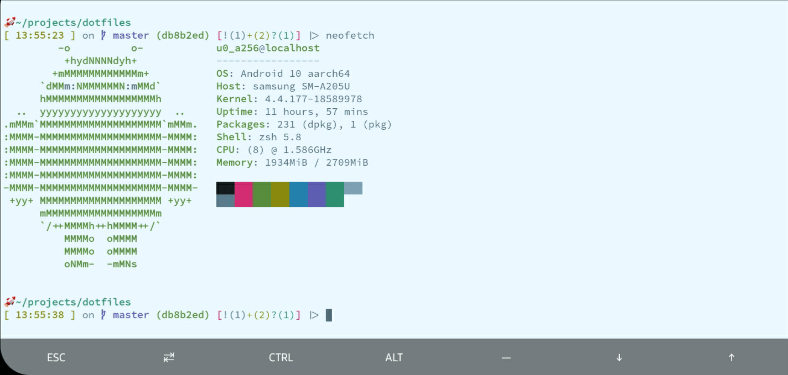
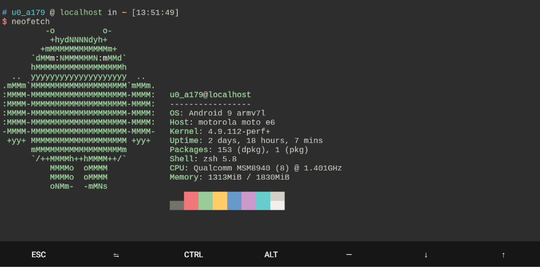

# alephalpha0 does dotfiles.  

I finally learned my lesson and now version control my dotfiles for posterity's sake and for the inevitable occurance of corrupted files/disk failure. There are no bootstrapping scripts or fancy installation mechanisms here. Just raw text files full of hopefully decently commented (and self-amusement fueled) lines. I rely heavily on CLI tools and toys to go about my commandline-gazing, and have [documented](./toolsoftrade.md) most of what I use.  

## `.zshenv` 
> Tried my best to keep this file for one use only: setting my ENVIRONMENT variables for programs and terminal. Made sure to get the `XDG_*_HOME` and `ZDOTDIR` paths set, as this helps with my OCD and wanting everything to be uniform in execution. Everything else is par for course.  

## `.gitconfig` and `.gitignore` 
> Nothing too exciting here. Just the basic config and an empty `.gitignore`... Maybe I'll utilize it one day. 

## `.config/liquidpromptrc` && `.config/starship.toml` 
> I am ever flighty with the choice of what prompt to use. Sometimes, I'm rocking [liquidprompt](https://github.com/nojhan/liquidprompt), and sometimes I'm rocking [starship](https://starship.rs/). Here recently, I've been satisfied with [Ys](https://blog.ysmood.org/my-ys-terminal-theme/) and it's presentation of information. 
 
 
  
### sources i've ravished like a fair damsel: 
+ [repo: caarlos0](https://github.com/caarlos0/dotfiles) - dotfiles for zstyle completion wrangling. 
+ [blog post: managing your dotfiles](https://www.anishathalye.com/2014/08/03/managing-your-dotfiles/) - ways of organizing and managing my dotfiles. **symlinks!**  
+ [blog post: command line productivity](https://blog.lftechnology.com/command-line-productivity-with-zsh-aliases-28b7cebfdff9) - turned me onto alias suffixes. sexy, sexy alias suffixes. 
+ [ZSH overview](http://strcat.de/zsh/) - Pretty detailed and thorough explaination and exploration of ZSH features.
